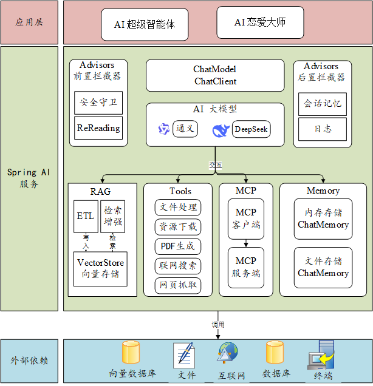

# yuAn_ai_agent 项目介绍

## 1、项目介绍

这是一套以 AI 开发实战为核心的项目教程，将通过开发 **AI 恋爱大师应用 + 拥有自主规划能力的超级智能体**。AI 恋爱大师应用‏可以依赖 AI 大模型解决用户的情؜感问题，支持多轮对话、基于自定义知识库进行问答、自主调用工具和 MC‌P 服务完成任务，比如调用地图服务‏获取附近地点并制定约会计划。

## 2、项目功能

1. AI 恋爱大师应用：用户在恋爱过程中难免遇到各种难题，让 AI 为用户提供贴心情感指导。支持多轮对话、对话记忆持久化、RAG 知识库检索、工具调用、MCP 服务调用。
2. AI 超级智能体：可以根据用户的需求，自主推理和行动，直到完成目标。
3. 提供给 AI 的工具：包括联网搜索、文件操作、网页抓取、资源下载、终端操作、PDF 生成。
4. AI MCP 服务：可以从特定网站搜索图片。

## 3、技术选型

项目以 S‏pring AI ؜开发框架实战为核心，涉及到多种主流 ‌AI 客户端和工具‏库的运用。

- Java 21 + Spring Boot 3 框架
- ⭐️ Spring AI 
- ⭐️ RAG 知识库
- ⭐️ PGvector 向量数据库
- ⭐ Tool Calling 工具调用
- ⭐️ MCP 模型上下文协议
- ⭐️ ReAct Agent 智能体构建
- ⭐️ AI 大模型开发平台百炼
- ⭐️ SSE 异步推送
- 第三方接口：如 SearchAPI / Pexels API
- 工具库如：Kryo 高性能序列化 + Jsoup 网页抓取 + iText PDF 生成 + Knife4j 接口文档

## 4、架构设计

## 5、项目收获

掌握下面的知识：

- AI 开发框架：Spring AI
- Prompt 工程和优化技巧
- Spring AI 核心特性：如自定义 Advisor、对话记忆、结构化输出
- RAG 知识库实战、原理和调优技巧
- PgVector 向量数据库 + 云数据库服务
- Tool Calling 工具调用实战及原理
- MCP 模型上下文协议和服务开发
- AI 智能体 Manus 原理和自主开发

了解各种新概念：如多模态、智能体工作流、A2A 协议、大模型评估等